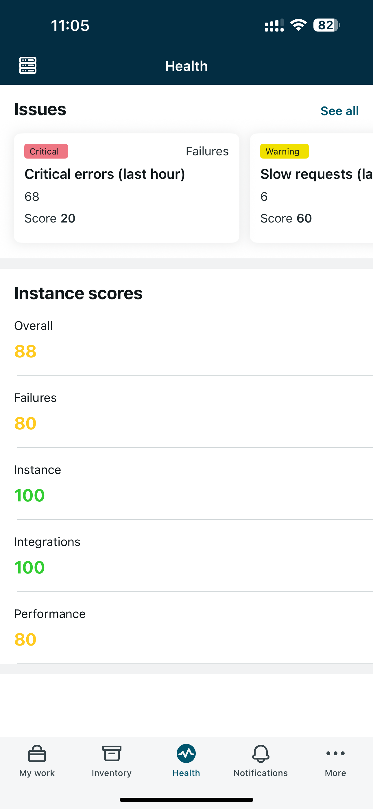

# ServiceNow Platform Health – Mobile

A **mobile admin application** providing a quick visual view of ServiceNow platform health indicators.

This project delivers a **ready-to-use mobile experience** for administrators, built on top of the **Platform Health Core** engine.

 

---

## 🎯 Purpose

This mobile application is designed to answer a simple question:

> *“Is my ServiceNow instance healthy right now?”*

It provides:
- a concise health overview
- clear status indicators
- fast access from a mobile device

It is intended for:
- ServiceNow administrators
- platform owners
- on-call or operations teams

---

## ⚠️ Scope & Intent

This mobile app is **not** a full monitoring solution.

It does **not** aim to:
- replace Instance Observer
- provide deep diagnostics
- expose historical analytics

It is a **lightweight, real-time health snapshot**, optimized for usability and speed.

---

## ✨ Key Features

- **Mobile-first admin experience accessible from Native ServiceNow Agent App** 
- **Health indicators by Category**
- **Clear status & score visualization**
- **Fast access to critical issues**

All indicator computation is handled by the **servicenow-platform-health-core application**.

---
## 🧩 Prerequisites & Architecture 

This application **requires the Platform Health Core application** to be installed and configured.

➡️ Core repository:  
https://github.com/j0hn2608/servicenow-platform-health-core

The mobile app:
- consumes the Remote Table exposed by the Platform Health Core application
- provide new data visualizations
- Focused on mobile UX

## 🚀 Installation (High-Level)

This project can be installed using **ServiceNow Source Control integration with GitHub**.

1. Clone the repository https://github.com/j0hn2608/servicenow-platform-health-mobile  

2. Connect your ServiceNow instance to GitHub  

3. Import the application from GitHub. Use **System Applications → Studio → Import App**

You can use this procedure as guidance for step 2 & 3: https://www.servicenow.com/community/developer-advocate-blog/source-control-in-servicenow-studio-complete-walkthrough/ba-p/3356303

---

## 🤝 Support & Services

This mobile application is open-source.

Professional services **may be offered separately**, including:
- mobile UX customization
- branding
- enterprise rollout
- training

---

## 🙌 Contributions

Contributions are welcome.

By submitting a pull request, you agree that your contribution will be licensed under the same license as this project.

---

## 📜 License

This project is licensed under the **Apache License 2.0**.

See the `LICENSE` file for details.

---

## ⚠️ Disclaimer

This project is **not affiliated with or endorsed by ServiceNow, Inc.**  
ServiceNow is a registered trademark of ServiceNow, Inc.

